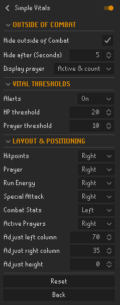
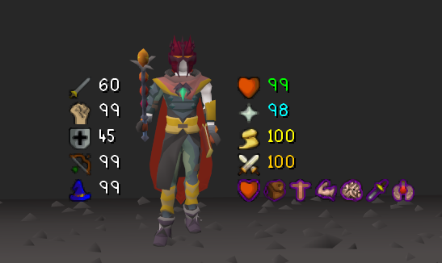

    

# **SIMPLE VITALS**
Keep track of your hiptpoints, prayers, buffs and debuffs!

### Features
* Combat stats with no boost or debuff show as white
* Combat stats with a boost show as green
* Combat stats with a debuff show as red
* Hitpoints & Prayer will show as red when the custom threshold is met
* If the Alerts option is active, Hitpoints & Prayer will flash between their default colour and red when the custom threshold is met
* If the Prayer icons options is active it will show the icon of each prayer you have active
* The HUD will remain centered around your character, unless you choose to change the offset values

### Menu and in-game example

